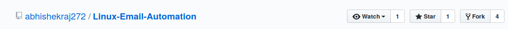

# Linux-Email-Automation

This script allows you to send multiple emails directly from the command line without you needing to open a browser.

You can send an unlimited number of emails to any number of people without any warning messages. The sent mail also goes directly into recipients' inboxes and not into spam.

## Prerequisites

Before you begin, you ensure you have met the following requirements:

* You have installed the latest version of Python3.
* You have a valid email address to use as the sender's email.
* SMTP via SSL uses port 465 so ensure this is open.

## Configuring the script

The `test.py` script contains the following default settings:

```python
port = 465
smtp_server = "smtp.gmail.com"
sender_email = ""
receiver_email = ""  
password = ""
date = time.ctime()
message = MIMEMultipart()
text = MIMEText("""\
Subject: #Subject here.
Current Time/Date: {date}
#Message here.
""")
message.attach(text)
img_data = open('', 'rb').read()
image = MIMEImage(img_data, name=os.path.basename())
message.attach(image)
```

## Using the script

To run the script, open a terminal and run:

```
$ python3 test.py
```

# How to contribute

First you need to make a "*fork*" from this repository, this is necessary because you can't change this repository directly.

1. On Github, navigate to [abhishekraj272/Linux-Email-Automation](https://github.com/abhishekraj272/Linux-Email-Automation)

2. In the top-right corner of the page, click **Fork**.



When you've finished your forking you'll be redirected to the page of your fork.
Then you update your contribution and create a new pull request.
All pull request and contribution are welcome.

Notice below the name of the repository that it is a "*fork*" of another.

## Making your change

1. Set up Git
If you don't have git installed you have to instal it, here a good tutorial to do it: [Instaling git](https://help.github.com/en/articles/set-up-git)

2. To make a change you need to clone your repository, to clone your repository click on the button, **Clone or download**


3. Click on the icon  to copy the url.

4. Open a terminal and type:
```bash
$ git clone https://github.com/USERNAME/Linux-Email-Automation
```

5. Go to the directory where you've cloned the repo and starting making your contribution.
